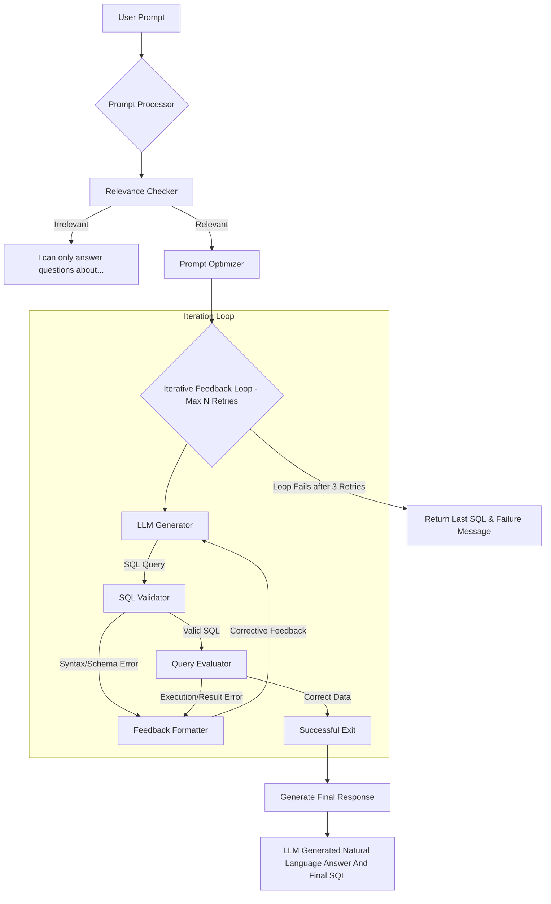

# 🤖 Langgraph Multi-Agent Text2SQL System

A Text2SQL agent that converts natural language queries into validated SQL statements using a multi-agent architecture built with LangGraph. The system mainly uses iterative feedback loops to refine SQL generation, ensuring accuracy through programmatic validation and evaluation stages. 

## 🏗️ Architecture

The agent follows a state graph workflow orchestrated by LangGraph, with agents that handle different stages of the SQL generation process:



## 🧩 Core Components

### Graph Orchestration (`graph.py`)
Defines the state machine using LangGraph's `StateGraph`, connecting agent nodes and defining conditional routing between them. The graph manages the workflow from initial prompt processing through SQL generation, validation, and final response generation.

### Agent Nodes (`agents.py`)
- **Relevance Checker**: Determines if the query is relevant to the database schema
- **SQL Generator**: Creates SQL queries from natural language using LLMs
- **SQL Validator**: Validates SQL syntax and schema compliance
- **Query Evaluator**: Assesses if the generated SQL correctly answers the user's question
- **Feedback Formatter**: Creates feedback for the generator when SQL needs refinement
- **Finalizer**: Generates the final natural language response

### State Management (`states.py`)
The `FullState` maintains context throughout the workflow, including:
- Conversation messages
- User query and optimized query
- Generated SQL and validation results
- Feedback history
- Loop counters and final verdict

### Configuration (`configuration.py`)
Manages runtime configuration through the `Configuration` class, allowing customization of:
- LLM models for different agent roles
- Maximum feedback loops
- Database schema

## 🚀 Usage

### 💻 Command Line Interface
The system can be run via the command line using `main.py`:

```bash
uv run main.py --query "Find customers from last month" --database-schema-json-path example_schema.json
```

Available options:
- `--query`: Natural language query (required) 
- `--database-schema-json-path`: Path to database schema JSON (required) 
- `--max-feedback-loops`: Maximum number of refinement attempts (default: 3) 
- `--relevance-checker-model`: LLM for relevance checking (default: llama-3.1-8b-instant) 
- `--query-generator-model`: LLM for SQL generation (default: moonshotai/kimi-k2-instruct) 
- `--query-evaluator-model`: LLM for query evaluation (default: moonshotai/kimi-k2-instruct) 
- `--finalizing-model`: LLM for final response generation (default: moonshotai/kimi-k2-instruct) 

### 🔧 Environment Configuration
Create a `.env` file with your API keys:
```
GROQ_API_KEY=your_api_key_here
```

### 🗃️ Database Schema Format
The system requires a JSON schema defining your database structure:
```json
{
  "tables": [
    {
      "table_name": "X",
      "columns": {
      }
    }
  ]
}
```

## 📦 Dependencies

The system requires:
- Python 3.13+
- UV Package Manager (Recommended)
- Groq API key (or compatible LLM provider)
- Required packages listed in `pyproject.toml`

Install dependencies:
```bash
uv pip install -r requirements.txt
```
OR
```bash
uv sync
```

## 🛠️ TO-DO
- [ ] Add support for more LLM providers
- [ ] Write better prompts 
- [ ] Add an `executor` that executes the query on a copy database, or generate mock data from the schema and execute the query.

## ❤️ Contributing
Contributions are always welcome :)
